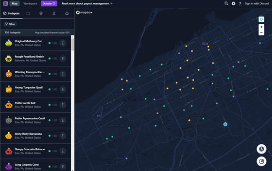
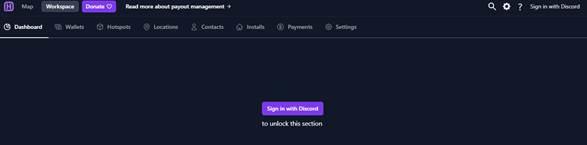

# Hotspotty App -  Quick Start Guide
**Hotspotty**
: The all-in-one tool for building the Helium Network. Understand your hotspot data, plan and manage your hotspots and payouts, collaborate with the community and your team, optimize network performance and HNT earnings and much more to come.

`So you've just discovered this cool new app to help manage your helium hotspots and want to give it a try. Here are the basic steps to login, add your wallet and hotspot(s) to a workspace, and verify your wallet so that you can message other owners and collaborate with your community.`

# Table of Contents

1. Quick Start - Sign up, add wallet and hotspots to your workspace, and verify your wallet.
2. The Map and the Workspace - A Brief Understanding
3. Using the Map
4. Using the Workspace

## The Map and The Workspace - A Brief Understanding
*The [Hotspotty app](https://app.hotspotty.net/) has two main tabs on the top left of the page - **Map** and **Workspace***
### The Map
- The **Map** tab will open by default when the [Hotspotty app](https://app.hotspotty.net/) is opened. If location is enabled in the browser you will see the hotspots in your current area.
  -  From here you can do many things including, but not limited to:
     -  Searching for hotspots and locations
     -  Open a hotspot to view its detailed information
     -  Message other hotspot owners and comment on hotspots
     -  Check and simulate transmit scaled to best plan for hotspot placement
 

### The Workspace
- The **Workspace** tab gives the ability for a single person or a team of persons to track and interact with multiple things including:
  - **Wallets** - gives the ability to track and label wallets associated with the workspace hotspots
  - **Hotspots** - Add and track hotspots in the workspace, whether they are owned or not owned by the workspace, they can be labeled as such if just tracking another hotspot.
  - **Locations** - Represent physical locations where you have access to (optionally through your contacts). The address/coordinates/height above the ground of a location should represent where the hotspot can be installed physically. 
    - Linking locations to contacts makes it easier to manage payouts later on.
  - **Contacts** - Represent anyone facilitating your hotspot deployment and optionally gets paid for their added value. This can range from someone providing locations to be assessed, to hosts or even regional deployment partners. You can link these contacts to their locations, so that installs can link them to the hotspot earnings.
  - **Installs** - Track the location at which a hotspot was installed over what period of time. This eases the deployment and payout management of many hotspots.
  - **Payments** - Calculate and track payouts for contacts that facilitate your hotspot deployments.
   