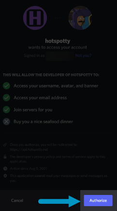

# Hotspotty App -  Quick Start Guide

**Hotspotty**
: The all-in-one tool for building the Helium Network. Understand your hotspot data, plan and manage your hotspots and payouts, collaborate with the community and your team, optimize network performance and HNT earnings and much more to come.  Hotspotty is a useful tool for any hotspot owner on the Helium network, from owning one to owning thousands of hotspots.

# Table of Contents

1. [Quick Start](#quick-start) - Sign up, add wallet(s) and hotspot(s) to your workspace, and verify your wallet(s).
2. The Map and the Workspace - A Brief Understanding
3. Using the Map
4. Using the Workspace

## Quick Start
*If you have made it here, you probably have the desire to use Hotspotty to its full potential. You are in the right place. Keeping reading to get started*

Here are the basic steps to get signed up and using the workspace.
1. [Login with Discord](#login-with-discord)
2. [Add wallet and hotspots to workspace](#add-wallet-and-hotspots-to-workspace)
3. Verify wallet so we know that it's you. This gives you messaging and commenting capablilities amongst other things as well!

### Login with Discord
*Hotspotty connects to discord to utilize it's communication power and allow The People's Network community to talk to one another.*

1. If you do not already have one, please [create a discord account](https://support.discord.com/hc/en-us/articles/360033931551-Getting-Started#h_01EYYMPAD6QZ0XR0ZRW00YGB0F). In only takes a few moments.
2. Go to the [Hotspotty]([(https://app.hotspotty.net/)) homepage and click Sign in with Discord at the top right of the page

  **Note: there are many places in the Hotspotty app that will you may navigate you that will ask you to login to Discord, this is just one.*
3. After being redirected to Discord, [sign in with your Discord credentials]((https://support.discord.com/hc/en-us/articles/360057027354-How-to-Login-to-your-Account)) and authorize the Hotspotty App by clicking the Authorize button as can be seen below.

    
4. You will now be redirected back to Hotspotty and should see your discord picture and handle as logged 'YourName's workspace' in the top right corner now:
    

**Congrats, you are logged in!**

### Add Wallet and Hotspots to workspace
 > While you can also hotspots individually, the easiest is way to add all hotspots that are connected to one wallet is to simply add the wallet and all the hotspots will be automatically added!

 1. Click on the workspace button from the homepage
## The Map and The Workspace - A Brief Understanding
*The [Hotspotty app](https://app.hotspotty.net/) has two main tabs on the top left of the page - **Map** and **Workspace***
### The Map
- The **Map** tab will open by default when the [Hotspotty app](https://app.hotspotty.net/) is opened. If location is enabled in the browser you will see the hotspots in your current area.
  -  From here you can do many things including, but not limited to:
     -  Searching for hotspots and locations
     -  Open a hotspot to view its detailed information
     -  Message other hotspot owners and comment on hotspots
     -  Check and simulate transmit scaled to best plan for hotspot placement
 

### The Workspace
- The **Workspace** tab gives the ability for a single person or a team of persons to track and interact with multiple things including:
  - **Wallets** - gives the ability to track and label wallets associated with the workspace hotspots
  - **Hotspots** - Add and track hotspots in the workspace, whether they are owned or not owned by the workspace, they can be labeled as such if just tracking another hotspot.
  - **Locations** - Represent physical locations where you have access to (optionally through your contacts). The address/coordinates/height above the ground of a location should represent where the hotspot can be installed physically. 
    - Linking locations to contacts makes it easier to manage payouts later on.
  - **Contacts** - Represent anyone facilitating your hotspot deployment and optionally gets paid for their added value. This can range from someone providing locations to be assessed, to hosts or even regional deployment partners. You can link these contacts to their locations, so that installs can link them to the hotspot earnings.
  - **Installs** - Track the location at which a hotspot was installed over what period of time. This eases the deployment and payout management of many hotspots.
  - **Payments** - Calculate and track payouts for contacts that facilitate your hotspot deployments.
   